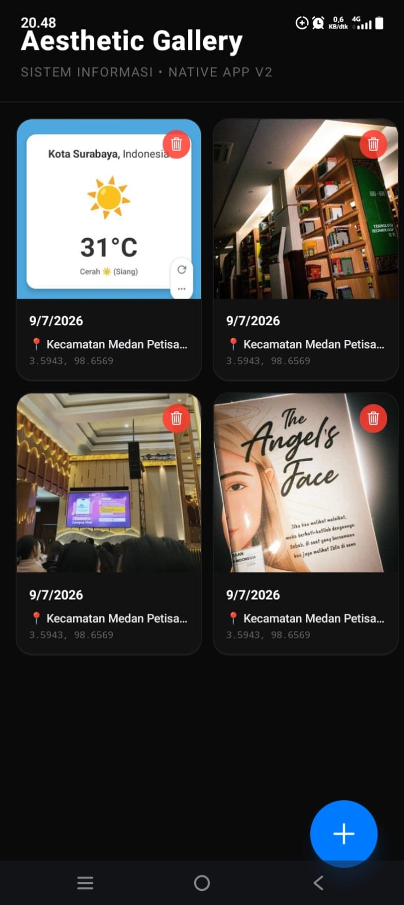

# 📸 Aesthetic Gallery App — Native Power App

Tugas Minggu 13 • Pemrograman Aplikasi Mobile (Sistem Informasi)  
Aplikasi galeri foto mini minimalis berbasis *local state* yang memanfaatkan kapabilitas hardware native perangkat (Kamera, Galeri Media, dan GPS) menggunakan Expo SDK.

---

## 🔗 Link Expo Snack
👉 [Buka Interaksi Aplikasi di Expo Snack](https://snack.expo.dev/@indriamalia31/148bf6)

---

## 🛠️ Tech Stack & Modul Native
- **Framework:** React Native (Expo Managed Workflow)
- **Design System:** Clean & Soft Light Aesthetic (Sage Green Theme)
- **Icons:** `@expo/vector-icons (Ionicons)`
- **Expo Modules:**
  - `expo-image-picker` (Akses hardware Kamera & Media Library)[cite: 1]
  - `expo-location` (Akses hardware GPS / Fine Location)[cite: 1]

---

## 🎯 Fitur yang Diimplementasikan

### 🟢 Level 1 — Fitur Wajib (Core)
- [x] **Akses Fitur Native:** Menggabungkan penangkapan gambar (kamera/galeri) dengan tracking koordinat GPS secara berkala[cite: 1].
- [x] **Permission Flow Benar:** Melakukan pemeriksaan asinkronus status `granted` sebelum membuka sensor hardware perangkat[cite: 1].
- [x] **Graceful Error Handling:** Apabila izin ditolak oleh pengguna, aplikasi memunculkan `Alert` sistem kustom tanpa menyebabkan aplikasi crash atau freeze[cite: 1].
- [x] **Render UI Responsif:** Menampilkan foto menggunakan komponen `<Image>` dengan dimensi absolut yang proporsional, lengkap dengan data geografis[cite: 1].

### 🟡 Level 2 — Pengembangan (Dipilih: 3 Fitur sekaligus)
- [x] **Kamera + Galeri:** Menyediakan dialog pilihan (*Action Alert*) bagi user untuk mengambil gambar lewat kamera langsung atau media library[cite: 1].
- [x] **Kamera + Lokasi:** Menghubungkan setiap data foto yang terekam dengan koordinat lintang (latitude) dan bujur (longitude) terkini[cite: 1].
- [x] **Galeri Multi-Foto:** Menyimpan kumpulan foto dalam struktur array objek dan me-render secara optimal menggunakan skema grid `<FlatList>` multi-kolom[cite: 1].

### 🔴 Level 3 — Tantangan Bonus (Nilai Tambahan)
- [x] **Modal Priming Screen:** Mengimplementasikan layar penjelasan edukatif kustom berdesain minimalis sebelum dialog izin resmi dari sistem operasi muncul demi kenyamanan UX pengguna[cite: 1].
- [x] **Reverse Geocoding (`Location.reverseGeocodeAsync`):** Mentransformasi data koordinat garis bujur/lintang mentah menjadi nama wilayah kontekstual yang mudah dipahami manusia (Contoh: *Kecamatan Medan Petisah*)[cite: 1].
- [x] **Hapus Karya Foto (Reset State):** Menyediakan tombol hapus melayang kustom pada pojok foto untuk memanipulasi array `.filter()` guna membersihkan galeri secara interaktif[cite: 1].

---

## 📸 Dokumentasi Screenshot (Uji HP Fisik)

Berikut adalah bukti pengujian aplikasi pada perangkat handphone fisik sesuai dengan test case yang diwajibkan[cite: 1]:

| 1. Dialog Izin (Priming Screen) | 2. Hasil Foto & Reverse Geocoding | 3. Penanganan Penolakan Izin |
| :---: | :---: | :---: |
|  |  |  |

---

## 🚀 Cara Menjalankan Proyek Secara Lokal

1. Clone repositori ini ke komputer Anda:
   ```bash
   git clone [https://github.com/username_kamu/nama-repo-kamu.git](https://github.com/username_kamu/nama-repo-kamu.git)


---

## Tugas Praktikum Pertemuan 14 - Galeri Mini

Aplikasi ini adalah Galeri Foto Estetik berbasis mobile yang berfungsi untuk menampilkan dan mengelola koleksi foto digital secara lokal. Fitur utamanya meliputi integrasi kamera bawaan perangkat, pengelolaan galeri foto mini, dan sistem perizinan akses media penyimpanan Android.

### Link Unduh Aplikasi (APK)
Kamu bisa mengunduh file APK aplikasi ini langsung melalui tautan EAS Dashboard berikut:
👉 [Unduh APK Galeri Mini](https://expo.dev/accounts/indriamalia31/projects/galeri-mini/builds/032300c4-d4bb-4361-87a7-df7f1470dc8a)

### Screenshot Aplikasi
Berikut adalah tampilan antarmuka dari aplikasi Galeri Mini:

